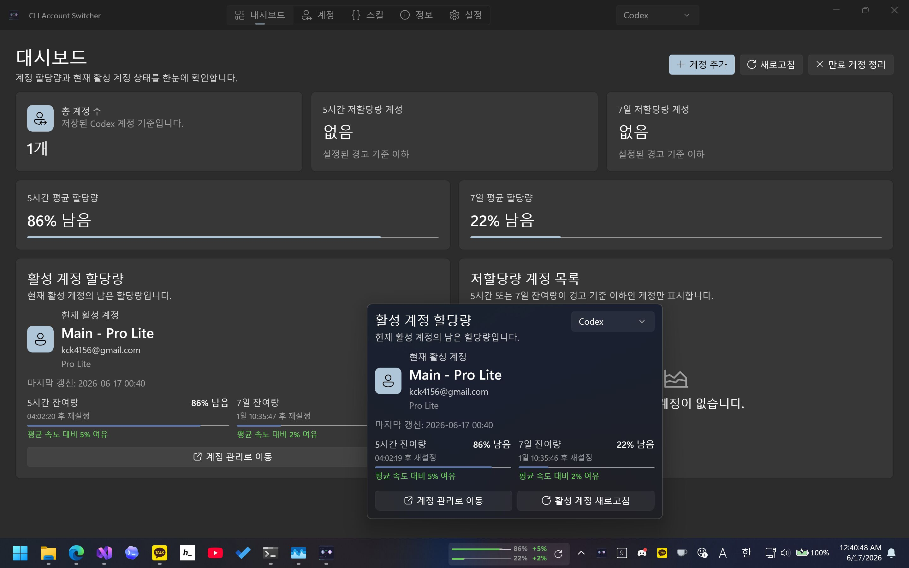

# CLI Account Switcher

🌐 [English](README.md)

CLI Account Switcher는 AI 서비스용 CLI 인증 계정을 관리하기 위한 Windows 데스크톱 유틸리티입니다. 현재 Codex 계정을 지원하며, Claude Code 및 GitHub Copilot 지원은 예정되어 있습니다.

앱은 저장된 계정 목록을 자체 로컬 앱 데이터 폴더에 보관하고, 선택한 인증 문서를 `%USERPROFILE%\.codex\auth.json`에 기록해 활성 Codex 계정을 전환합니다.

## 주요 기능

- OAuth 로그인, 현재 `auth.json`, JSON 파일, 직접 붙여넣은 인증 JSON으로 Codex 계정을 추가합니다.
- 계정 화면에서 활성 Codex 계정을 전환합니다.
- Codex 플랜과 5시간/주간 잔여 사용량 정보를 확인합니다.
- Claude Code 및 GitHub Copilot 계정 전환 지원은 예정되어 있습니다.
- 전체 창을 열지 않고 트레이 아이콘을 눌러 활성 계정의 남은 사용량을 빠르게 확인합니다.
- 계정 사용량을 새로 고치고 만료된 계정을 감지합니다.
- 저장된 계정을 백업하고 복원합니다.

## 화면 구성

- **대시보드**: 활성 계정 요약, 평균 잔여 사용량, 사용량이 낮은 계정 목록을 보여줍니다.
- **계정**: 검색과 플랜 필터를 지원하는 계정 목록에서 전환, 새로 고침, 이름 변경, 삭제, 백업, 복원을 수행합니다.
- **트레이 아이콘 팝업**: 트레이 아이콘을 눌러 활성 계정의 사용량을 빠르게 확인하고 새로 고칩니다.
- **설정**: 언어, 테마, 시작 프로그램, 업데이트 확인, 새로 고침 간격, 경고 임계값, 알림, 설정 가져오기/내보내기를 관리합니다.
- **정보**: 앱 버전과 서드파티 라이선스 정보를 보여줍니다.

## 기본 사용 흐름

1. 계정 화면에서 하나 이상의 Codex 계정을 추가합니다.
2. 앱이 계정을 검증한 뒤 플랜과 사용량 정보를 확인합니다.
3. 사용할 계정을 선택해 활성 Codex 계정으로 전환합니다.
4. 실행 중인 Codex 프로세스가 새 `auth.json`을 읽도록 안내가 표시되면 Codex를 다시 시작합니다.
5. 다른 Windows 설치 환경으로 계정이나 설정을 옮길 때 백업/내보내기 기능을 사용합니다.

계정 전환은 `%USERPROFILE%\.codex\auth.json`을 덮어씁니다. 해당 파일을 직접 관리하거나 다른 도구와 함께 사용 중이라면 먼저 백업해 두세요.

## 요구 사항

- Windows 10 버전 1809 이상.
- 개발 환경: .NET 10 SDK, Windows App SDK, WinUI/MSIX 도구가 포함된 Visual Studio.

## 개발 정보

저장소는 세 프로젝트로 구성됩니다.

| 프로젝트 | 설명 |
| --- | --- |
| `CliAccountSwitcher.WinUI` | 패키징된 WinUI 3 데스크톱 앱입니다. |
| `CliAccountSwitcher.Api` | Codex OAuth, 인증 문서, 사용량, 모델, API 클라이언트 도우미를 담당합니다. |
| `CliAccountSwitcher.Api.Test` | Codex API 동작을 실험하기 위한 콘솔 프로젝트입니다. |

WinUI 앱은 `net10.0-windows10.0.26100.0`을 대상으로 하며, NativeAOT 게시와 MSIX 도구를 사용하고 `x86`, `x64`, `ARM64` 패키지 번들을 지원합니다.

게시 프로필은 `CliAccountSwitcher.WinUI/Properties/PublishProfiles`에 있습니다.

## 현지화

현재 앱에는 다음 언어 리소스가 포함되어 있습니다.

- 영어 (`en-US`)
- 한국어 (`ko-KR`)
- 일본어 (`ja-JP`)
- 중국어 간체 (`zh-Hans`)
- 중국어 번체 (`zh-Hant`)

## 감사의 글

- 이 프로젝트는 OpenAI Codex의 도움을 받아 생성되었습니다.
- [isxlan0/Codex_AccountSwitch](https://github.com/isxlan0/Codex_AccountSwitch)에서 영감을 받았습니다.
- 고품질 WinUI 컨트롤을 제공한 DevWinUI 프로젝트에 감사드립니다.

## 라이선스

이 프로젝트는 [MIT License](LICENSE)를 따릅니다.
