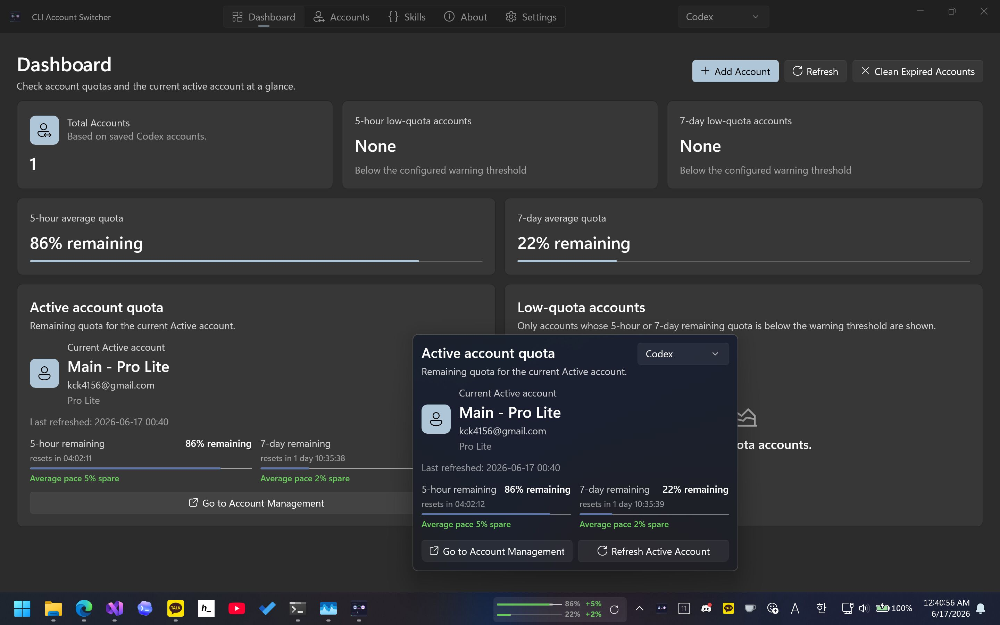

# CLI Account Switcher

🌐 [한국어](README.ko.md)

CLI Account Switcher is a Windows desktop utility for managing CLI authentication accounts for AI services. It supports Codex and Claude Code accounts.

The app stores saved account records in its own local application data folder and switches the active Codex or Claude Code account by writing the selected authentication document to the relevant local authentication file.

## Features

- Add Codex and Claude Code accounts with the supported sign-in and import flows.
- Switch the active Codex or Claude Code account from the Accounts screen.
- View plan information and remaining usage for supported accounts.
- Manage Codex and Claude Code accounts in one Windows app.
- Click the tray icon to open a quick active account usage popup without opening the full window.
- Refresh account usage and detect expired accounts.
- Back up and restore saved accounts.

## Screens

- **Dashboard**: active account summary, average remaining usage, and low-usage account list.
- **Accounts**: searchable and filterable account list with switch, refresh, rename, delete, backup, and restore actions.
- **Tray icon popup**: quick active account quota view with refresh support from the tray icon.
- **Settings**: language, theme, startup launch, update checks, refresh intervals, warning thresholds, notifications, and settings import/export.
- **About**: app version and third-party license information.

## Basic Workflow

1. Add one or more Codex or Claude Code accounts from the Accounts screen.
2. Review plan and usage information after the app validates each account.
3. Select an account and switch it to make it the active account for the matching CLI.
4. Restart Codex or Claude Code when prompted so running sessions pick up the newly written authentication file.
5. Use backup/export features when moving accounts or settings to another Windows installation.

Switching an account overwrites the local authentication file used by the selected CLI. If you already manage those files manually or with another tool, make a backup first.

## Requirements

- Windows 10 version 1809 or later.
- For development: .NET 10 SDK, Windows App SDK, and Visual Studio with WinUI/MSIX tooling.

## Development

The repository contains three projects:

| Project | Description |
| --- | --- |
| `CliAccountSwitcher.WinUI` | Packaged WinUI 3 desktop app. |
| `CliAccountSwitcher.Api` | Codex and Claude Code authentication, usage, models, and API client helpers. |
| `CliAccountSwitcher.Api.Test` | Console experiment project for Codex and Claude Code API behavior. |

The WinUI app targets `net10.0-windows10.0.26100.0`, enables NativeAOT publishing, uses MSIX tooling, and supports `x86`, `x64`, and `ARM64` package bundles.

Publish profiles live in `CliAccountSwitcher.WinUI/Properties/PublishProfiles`.

## Localization

The app currently includes localized resources for:

- English (`en-US`)
- Korean (`ko-KR`)
- Japanese (`ja-JP`)
- Simplified Chinese (`zh-Hans`)
- Traditional Chinese (`zh-Hant`)

## Acknowledgements

- This project was generated with help from OpenAI Codex.
- This project is inspired by [isxlan0/Codex_AccountSwitch](https://github.com/isxlan0/Codex_AccountSwitch).
- Thanks to the DevWinUI project for providing high-quality WinUI controls.

## License

This project is licensed under the [MIT License](LICENSE).
